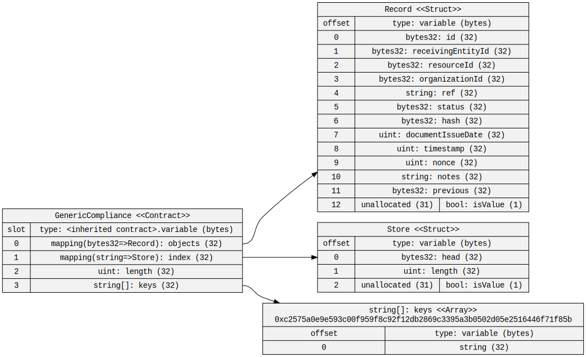
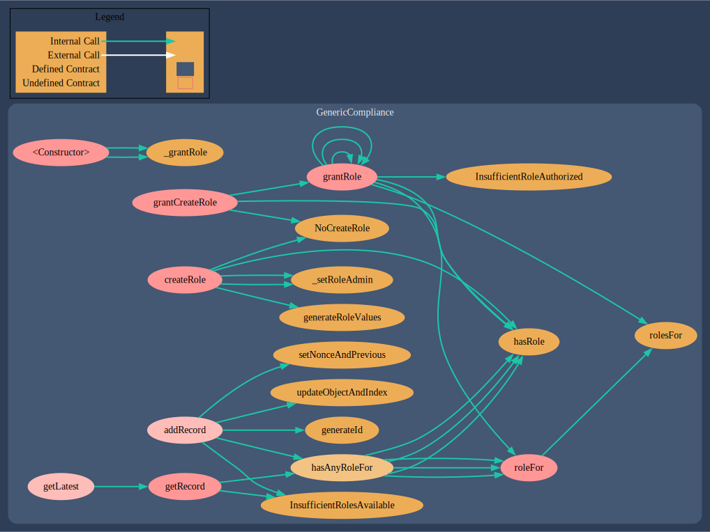
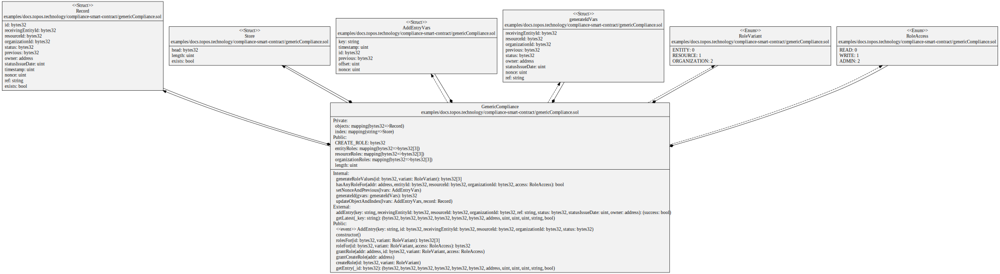

# Compliance Management Smart Contract

Data management for compliance can be challening, but the combination of smart contracts, blockchain based storage, and Zero-Knowledge Proofs that are present in the Topos ecosystem make it a compelling solution for compliance management.

## Overview

This directory contains a single smart contract, built as a proof-of-concept for a compliance management system. The smart contract is written in Solidity, and as written, it is ready to deploy to the Topos Testnet.

**Note: This is a proof-of-concept, and is provided as-is, with no guarantees of suitability for your use case. It has not been audited and likely has bugs, so it should not be used as-is in a production environment.**

The contract provides a simple interface for managing access control, for allowing authorized users to submit records for storage, and for retrieving records later. Records are stored as linked lists, indexed by an arbitrary key. In this way, the dApp that is using the contract can choose how it references records, while the smart contract system ensures that all of the records for any particular resource can be traversed, and that the most recent record is always easily accessible.

## Usage

## TODO

* [ ] Make the contract upgradeable