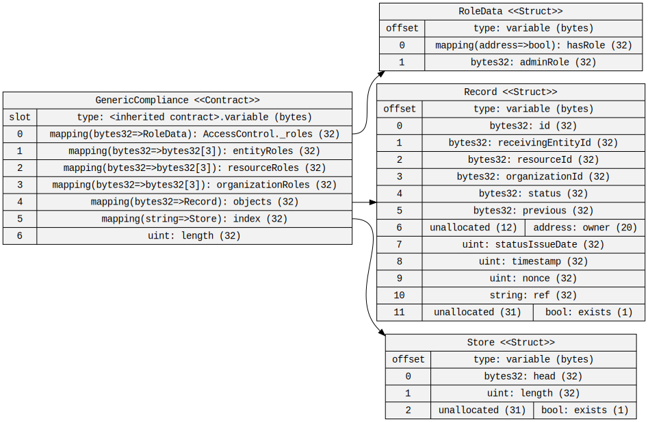

# Compliance Management Smart Contract

Data management for compliance can be challening, but the combination of smart contracts, blockchain based storage, and Zero-Knowledge Proofs that are present in the Topos ecosystem make it a compelling solution for compliance management.

## Overview

This directory contains a single smart contract, built as a proof-of-concept for a compliance management system. The smart contract is written in Solidity, and as written, it is ready to deploy to the Topos Testnet.

**Note: This is a proof-of-concept, and is provided as-is, with no guarantees of suitability for your use case. It has not been audited and likely has bugs, so it should not be used as-is in a production environment.**

The contract provides a simple interface for managing access control, for allowing authorized users to submit records for storage, and for retrieving records later. Records are stored as linked lists, indexed by an arbitrary key. In this way, the dApp that is using the contract can choose how it references records, while the smart contract system ensures that all of the records for any particular resource can be traversed, and that the most recent record is always easily accessible.



## Usage

After [deploying the contract to the Topos Testnet](https://docs.topos.technology/content/how-to/deploy-a-contract-to-topos.html), the contract is ready for use. If you want to experiment with it locally before deploying to the Topos Testnet, we suggest using the Remix IDE for easy deployment and testing.

[Clicking here](https://remix.ethereum.org/topos-protocol/example-code-depot/blob/main/examples/docs.topos.technology/compliance-smart-contract/GenericComplaince.sol) will open an IDE in your browser, with the contract loaded and compiled. If you are unfamiliar with the Remix IDE, refer to the [Deploy a Contract to a Topos Subnet](https://docs.topos.technology/content/how-to/deploy-a-contract-to-topos.html) guide for a brief introduction.

By convention, the account that deploys the contract has full access to the contract. It can create roles, grant roles to accounts, revoke roles, submit records, and retrieve records. In a production environment, this account would likely only be used to deploy the contract, and to then grant the `CREATE` role (`grantCreateRole(address addr)`) to another account which would be used by the dapp for managing access control to the contract.

Access control is role based, with `READ`, `WRITE`, and `ADMIN` roles available for any given entity ID, resource ID, or organization ID. Roles are created using the `createRole(bytes32 id, RoleVariant variant)` function. The `RoleVariant` enum is defined in the contract, and has three values: `ENTITY`, `RESOURCE`, and `ORGANIZATION`. The `createRole` function can only be called by an account that has been granted the `CREATE` role with the aforementioned `grantCreateRole` function.

This will create the `READ`, `WRITE`, and `ADMIN` roles for the given ID/variant pair. These can then be granted to other accounts using the `grantRole(address addr, bytes32 id, RoleVariant variant, RoleAccess access)` function, and revoked using the `revokeRole` function.

```solidity
grantRole(clientAddress, organizationId, RoleVariant.ORGANIZATION, RoleAccess.READ);
grantRole(clientAddress, organizationId, RoleVariant.ORGANIZATION, RoleAccess.WRITE);
```

Roles are granular and individual. Thus, an address which as been granted only `WRITE` for an organization ID can submit records for that organization, but cannot retrieve those records. An address which has been granted only `READ` for an organization ID can retrieve records for that organization, but cannot submit records. An address which has been granted only `ADMIN` for an organization ID can grant permissions to itself or to other addresses, but can not submit or retrieve records (unless it first grants itself the permissions to do so).

Records are submitted using the `addRecord` function. This function has a fairly large call signature:

```solidity
    function addRecord(
        string calldata key,
        bytes32 receivingEntityId,
        bytes32 resourceId,
        bytes32 organizationId,
        string calldata ref,
        bytes32 status,
        uint statusIssueDate,
        address owner
    ) external returns (bool success)
```

The `ref` field can be any data that makes sense for the dApp, but it is suggested that this either be a URL that refers back to the full original resource, or it be a JSON data field with whatever additional information is needed. The contents of all of the other fields are up to the dApp. Note that the `owner` should reflect the account that _owns_ the resource, which may be different than the account that is submitting the record.

Each record will be indexed by the `key` field, with subsequent records from the same `key` being added to the linked list of records for that resource. In many cases, the `key` and the `resourceId` will be the same, though this contract doesn't force this to be the case. To retrieve the most recent record for a given `key`, use the `getLatest(string calldata _key)` function.

```solidity
Record record = getLatest("my-resource-key");
```

The `getLatest` function will return a `Record` struct, which contains all of the fields that were submitted with the `addRecord` function, as well as a `exists` field, which will only be true if this is a record that actually exists, and a `previous` field, which is the key of the previous record in the linked list. This can be used with the `getRecord(bytes32 _id)` function to traverse the linked list of records for a given resource.

```solidity
Record record = getLatest("my-resource-key");

do {
    //
    // do something with the record
    //
    record = getRecord(record.previous);
} while (record.exists);
```


## TODO

* [ ] Make the contract upgradeable